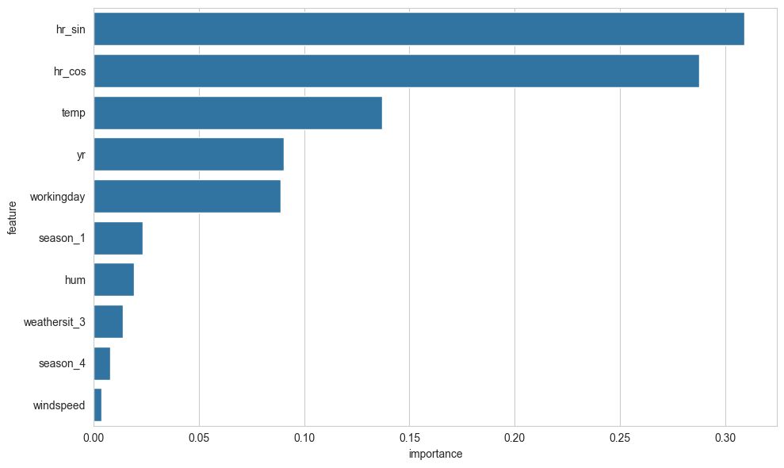

# Bike Sharing Demand Prediction

## TL;DR
- Built ML models to predict hourly bike demand
- Achieved **0.93 R²** using Random Forest
- Engineered cyclical time features to capture daily patterns
- Found that **time-of-day and temperature are the strongest predictors**
- Deployed interactive app: [Live Demo](notebooks/01_eda_and_modeling.ipynb)

## Overview
Bike sharing systems generate valuable transportation data that can be used to better understand how factors such as weather, seasonality, and time of day affect ridership. Predicting bike rental demand is useful for improving bike availability, managing fleet allocation, and supporting urban planning decisions.

In this project, I built and compared several machine learning regression models to predict the hourly number of bike rentals (cnt) using features related to weather, calendar patterns, and time.

The workflow included:

- Data exploration and feature analysis
- Feature engineering
- Exploratory data analysis (EDA)
- Preprocessing with pipelines
- Model training and evaluation
- Model comparison
- Residual analysis
- Feature importance interpretation

[View the Notebook](notebooks/01_eda_and_modeling.ipynb)

## Live Demo
https://your-streamlit-link

## Objective
The goal of this project was to predict hourly bike rental demand and determine which machine learning model performs best on this dataset.

## Dataset

The dataset used in this project is the Bike Sharing Dataset, specifically the hourly data file.

### Target Variable
- **cnt**: Total number of bike rentals in a give hour

### Feature Types

- **Time**: hour, month, weekday, season, year
- **Weather**: temperature, humidity, windspeed, weather situation
- **Calendar effects**: holiday, working day

## Feature Engineering

Several preprocessing and feature engineering steps were performed before modelling:
- Created cyclical time features using sine and cosine transformations of the hr variable:
    - **hr_sin**
    - **hr_cos**
- Removed the original hr column after transformation
- Examined the correlation between temp and atemp
- Dropped atemp due to high redundancy with temp
- Removed columns such as instant, casual, and registered
    - casual and registered were excluded because they directly sum to the target and would cause data leakage
 
## Exploratory Data Analysis

The EDA revealed several important patterns:
- The target variable (cnt) is **right-skewed**, with many moderate-demand hours and fewer high-demand hours
- Bike demand varies strongly by **time of day**
- **Temperature** has a positive relationship with bike rentals
- **Humidity** shows a negative relationship with demand
- Demand is generally higher during **warmer seasons**
- Usage appears to increase in the second year of the dataset
- Working days tend to have slightly higher demand, likely due to commuting behaviour.

These findings suggested that the relationships in the dataset were **likely nonlinear**, making tree-based models a strong choice.

## Models Used

The following regression models were trained and evaluated:
- Linear Regression
- Decision Tree Regressor
- Random Forest Regressor
- Gradient Boosting Regressor
- XGBoost Regressor

## Preprocessing

To ensure consistent and leak-free preprocessing, I used scikit-learn pipelines and ColumnTransformer.

**For categorical variables:**
- Missing values imputed with most frequent value
- One-hot encoding applied where appropriate

**For numerical variables:**
- Missing values imputed with median
- Standard scaling applied for Linear Regression only

Separate preprocessing pipelines were used for:
- **Linear models** requiring scaling
- **Tree-based models** not requiring scaling

## Evaluation Metrics

Models were evaluated using:
- **R²**
- **Root Mean Squared Error (RMSE)**
Performance was assessed using both:
- **Holdout test set**
- **5-fold cross-validation**
Cross-validation performance was used as the main basis for model comparison.

## Results

The results showed a clear performance gap between linear and tree-based methods.

## Model Performance Summary
| Model | R² | RMSE | CV R² | CV RMSE |
|------|------|------|------|------|
| Random Forest | 0.932 | 46.647 | 0.928 | 48.881 |
| XGBoost | 0.912 | 53.304 | 0.910 | 54.650 |
| Gradient Boosting | 0.877 | 62.940 | 0.872 | 65.130 |
| Decision Tree | 0.713 | 96.012 | 0.710 | 98.028 |
| Linear Regression | 0.508 | 125.766 | 0.508 | 127.593 |

## Best Model

The **Random Forest Regressor** achieved the best overall performance, with the highest cross-validation R² and the lowest RMSE.

This suggests that bike rental demand depends on **nonlinear relationships** and feature interactions that are better captured by ensemble tree-based models than by a simple linear model.

## Residual Analysis

Residual analysis of the Random Forest model showed that:
- Residuals were generally centered around zero
- The model did not show major systematic bias
- Prediction error increased somewhat at higher demand levels

This indicates that the model performs strongly overall, though extreme high-demand periods remain more difficult to predict accurately.

## Feature Importance

Feature importance from the Random Forest model showed that the most important predictors were:
- hr_cos
- hr_sin
- temp
- yr
- workingday

These results suggest that **time-of-day patterns are the strongest drivers of bike rental demand**, followed by temperature and calendar-based effects.

## Key Takeaways
- Bike rental demand is strongly influenced by daily usage cycles
- Temperature is one of the most important weather-related predictors
- Seasonal and calendar-related variables also contribute meaningfully
- Tree-based ensemble methods substantially outperform linear regression on this dataset
- Random Forest provided the strongest balance of predictive accuracy and interpretability

## Tools and Libraries
- Python
- pandas
- NumPy
- matplotlib
- seaborn
- scikit-learn
- XGBoost
- Streamlit

## Conclusion

This project demonstrates a full regression workflow for predicting hourly bike rental demand using machine learning. After comparing multiple models, Random Forest achieved the best results, indicating that nonlinear ensemble methods are well suited for this problem.

Overall, the analysis shows that bike demand is primarily driven by time-of-day patterns, weather conditions, and seasonal effects, and that machine learning can model these patterns effectively.
